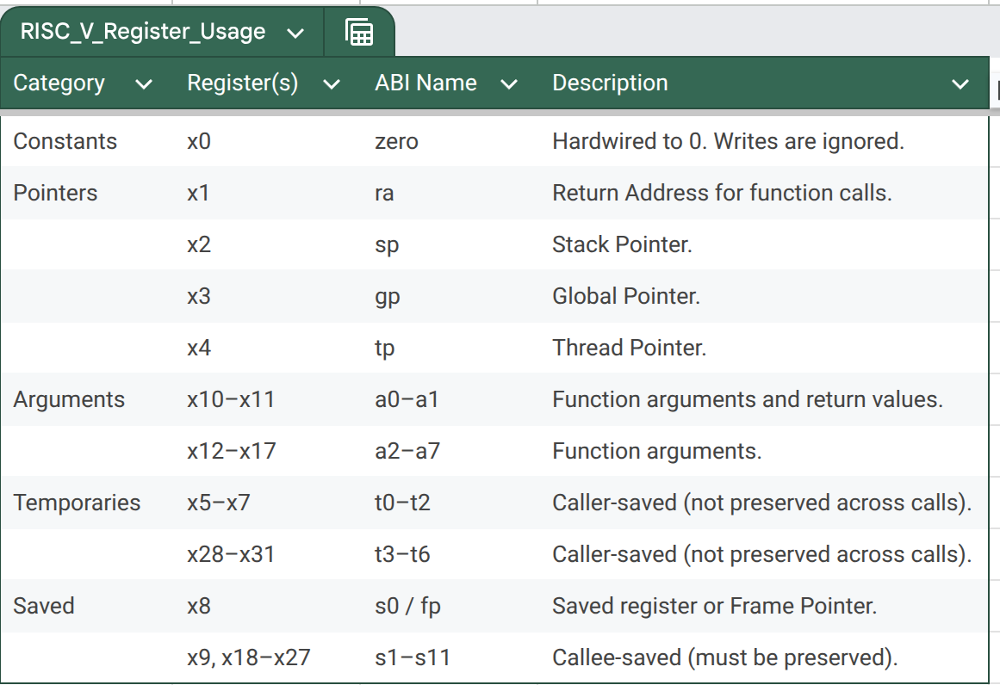
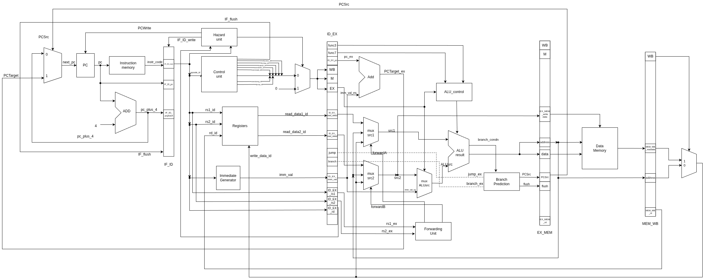
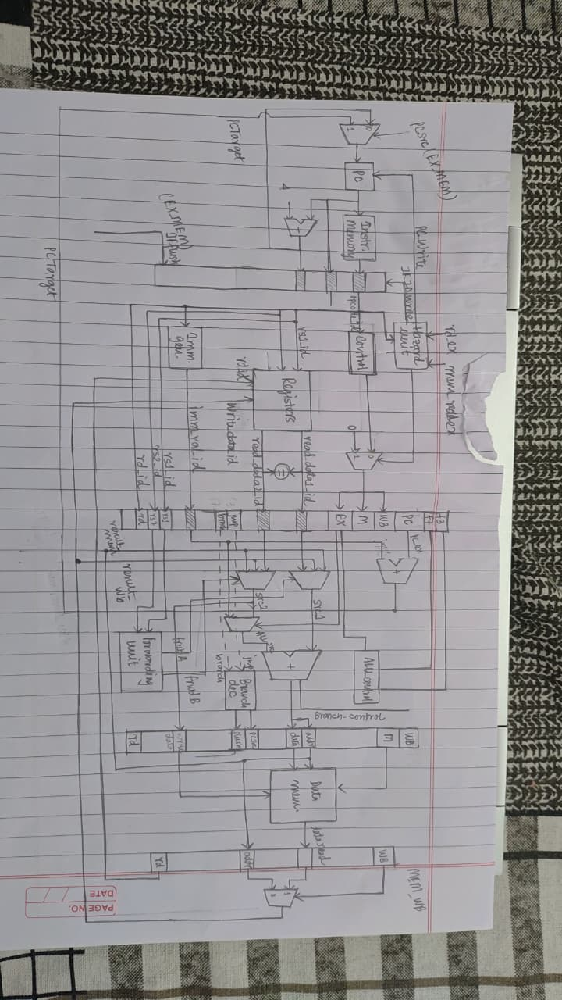
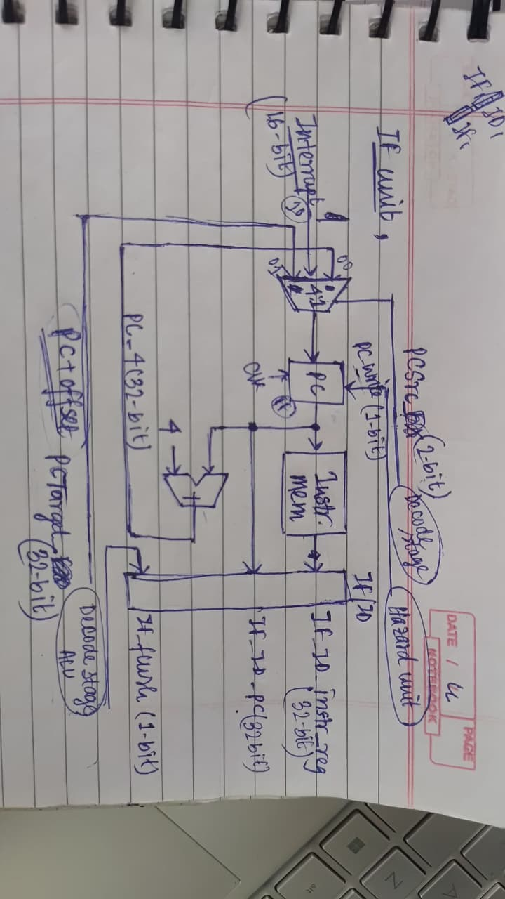
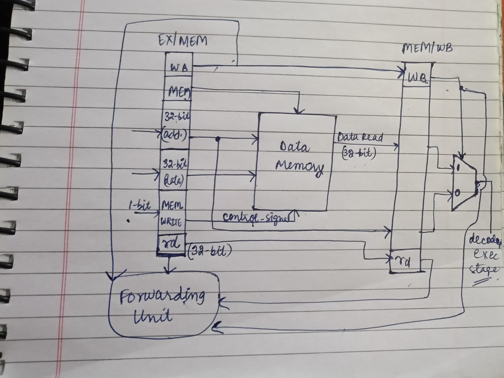
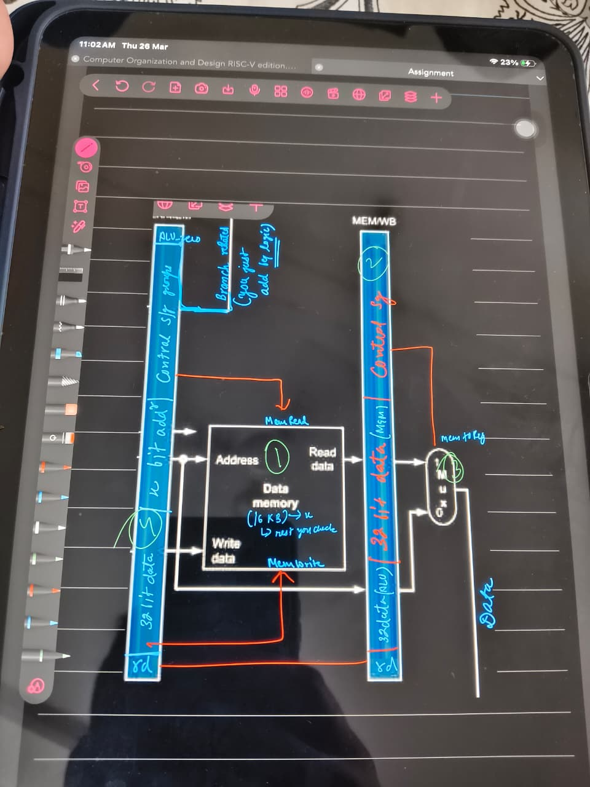

# 🚀 RISC-V 5-Stage Pipeline Processor (RV32I)

## 📌 Overview

This project implements a **5-stage pipelined RISC-V processor (RV32I)** in Verilog, designed with a strong focus on **modularity, hazard handling, and system-level extensibility**.

Unlike basic academic implementations, this design is structured to evolve into a **complete SoC**, with ongoing integration of **AMBA APB bus and multiple peripherals**.

---

## 🧠 Key Features

- ✅ 5-stage pipelined architecture (IF → ID → EX → MEM → WB)
- ✅ Full RV32I base instruction support
- ✅ Data hazard handling via **forwarding unit**
- ✅ Load-use hazard detection via **stall logic**
- ✅ Pipeline register isolation for clean timing
- ✅ Modular RTL design for easy extension
- 🚧 Ongoing: AMBA APB bus + peripheral integration

---

## 🏗️ Architecture Overview

```
IF → ID → EX → MEM → WB
```

> 📁 Block diagrams are available in the [`docs/`](./processor/docs/) folder.

---

## 🔹 Pipeline Stages

### 1. Instruction Fetch (IF)
- Program Counter (PC)
- Instruction Memory
- PC + 4 logic

### 2. Instruction Decode (ID)
- Register File (with read bypass)
- Immediate Generator
- Control Unit

### 3. Execute (EX)
- ALU operations
- Branch decision logic
- Forwarding logic
- PC-relative computations (AUIPC, JAL, JALR)

### 4. Memory (MEM)
- Data memory access (load/store)
- Supports byte/word operations

### 5. Write Back (WB)
- Writes ALU result or memory data back to the register file

---

## ⚠️ Hazard Handling

### 🔸 Data Hazards — Forwarding Unit

Bypasses stale register values using pipeline stage outputs:

| Forward Path     | Condition                              |
|------------------|----------------------------------------|
| EX → EX          | `ex_mem_rd == id_ex_rs1/rs2` (priority)|
| MEM → EX         | `mem_wb_rd == id_ex_rs1/rs2`           |
| No forward       | Default — uses register file value     |

### 🔸 Load-Use Hazard — Stall Logic

Triggered when a load result is needed by the very next instruction:

```verilog
if (MemRead_ex && (rd_ex != 0) &&
   ((rs1_id == rd_ex) || (rs2_id == rd_ex)))
```

**Action taken:**
- PC is frozen (`PC_Write = 0`)
- IF/ID and ID/EX registers are frozen
- Control signals zeroed → **NOP bubble** inserted

---

## 🎛️ Control Unit

Generates datapath control signals based on the instruction opcode:

| Instruction | RegWrite | MemRead | MemWrite | Branch | Jump | alu_pc_sel |
|-------------|----------|---------|----------|--------|------|------------|
| R-Type      | ✔        | ✖       | ✖        | ✖      | ✖    | ✖          |
| I-Type      | ✔        | ✖       | ✖        | ✖      | ✖    | ✖          |
| Load        | ✔        | ✔       | ✖        | ✖      | ✖    | ✖          |
| Store       | ✖        | ✖       | ✔        | ✖      | ✖    | ✖          |
| Branch      | ✖        | ✖       | ✖        | ✔      | ✖    | ✖          |
| JAL         | ✔        | ✖       | ✖        | ✖      | ✔    | ✔          |
| JALR        | ✔        | ✖       | ✖        | ✖      | ✔    | ✔          |
| LUI         | ✔        | ✖       | ✖        | ✖      | ✖    | ✖          |
| AUIPC       | ✔        | ✖       | ✖        | ✖      | ✖    | ✔          |

> A `control_mux` zeroes all signals on stall to insert a clean NOP into the pipeline.

---

## Register Names



---

## 🧩 Repository Structure

```
RISC_V_FIVE_STAGE/
│
├── processor/
│   ├── docs/                        # 📐 Block diagrams, reference PDFs
│   ├── rtl/
│   │   ├── include/                 # Global defines (defines.vh)
│   │   ├── instruction_fetch_unit/  # PC, instruction memory
│   │   ├── instruction_decode_unit/ # RegFile, control, imm-gen
│   │   ├── execution_unit/          # ALU, branch, forwarding
│   │   ├── data_memory_unit/        # Load/store memory
│   │   ├── writeback_unit/          # WB mux
│   │   ├── hazard_unit/             # Stall + forwarding control
│   │   ├── pipeline/                # IF/ID, ID/EX, EX/MEM, MEM/WB regs
│   │   └── top/                     # Top-level integration
│   │
│   ├── testbench/                   # TB files (unit + top-level)
│   ├── simulations/                 # VCD waveforms, memory dumps
│   ├── scripts/                     # Makefile + automation
│   └── programs/                    # program.mem hex files
│
├── communication_protocols/
│   └── uart/                        # UART module (in progress)
│
├── accelerator/
│   └── ascon128/                    # Crypto accelerator (planned)
│
└── README.md
```

---

## ▶️ Simulation Flow

### Option 1 — Using Make (recommended)

```bash
cd processor/scripts
make run
```

```bash
make run QUIET=0      # show full compile logs
make clean            # clean simulation outputs
make help             # list all targets
```

### Option 2 — Manual (Icarus Verilog)

```bash
iverilog -I rtl/include -o simulations/out.vvp \
    $(find rtl -name "*.v") testbench/top_tb.v
vvp simulations/out.vvp
```

### View Waveform

```bash
gtkwave simulations/dump.vcd
```

### Load a Program

```bash
cd processor/programs
gedit program.mem      # edit hex instructions directly
```

---

## 🧪 Verification

- ✔ Unit-level testing (ALU, RegFile, Hazard Unit)
- ✔ Pipeline-level integration simulation
- ✔ Waveform-based debugging via GTKWave
- ✔ Memory dump inspection

---

## 📐 Block Diagrams

All architecture diagrams are stored in [`processor/docs/`](./processor/docs/).



---










---

## 🚧 Ongoing Work — SoC Integration

This processor is being extended into a **complete SoC platform**.

```
RISC-V Core  →  APB Master  →  Peripheral Slaves
                                ├── UART
                                ├── SPI
                                ├── GPIO
                                ├── Timer
                                └── ASCON128 Accelerator
```

| Component        | Status         |
|------------------|----------------|
| AMBA APB Bus     | 🚧 In Progress  |
| UART             | 🚧 In Progress  |
| SPI              | 🔲 Planned      |
| GPIO             | 🔲 Planned      |
| Timer            | 🔲 Planned      |
| ASCON128         | 🔲 Planned      |

---

## 🎯 Design Philosophy

- **Modularity** — each unit is independently testable
- **Correctness** — hazards resolved cleanly without data corruption
- **Extensibility** — structured to grow into a full SoC
- **Readability** — clear signal naming and stage isolation

---

## 📚 References

- Patterson & Hennessy — *Computer Organization and Design (RISC-V Edition)*
- [RISC-V ISA Specification](https://riscv.org/technical/specifications/)
- AMBA APB Protocol Specification (ARM IHI0024)
- Course materials and lecture notes

---

## 👨‍💻 Author

**Team Vault-V**

---

## ⭐ Notes

This project goes beyond a basic CPU and is actively evolving into a **system-level design platform**, suitable for:

- Academic learning and coursework
- RTL design portfolio / interviews
- SoC architecture exploration
